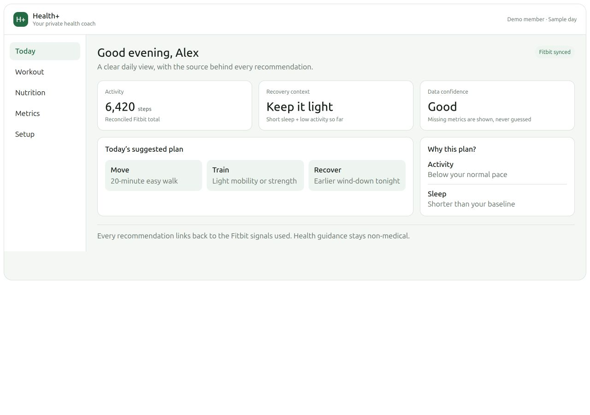
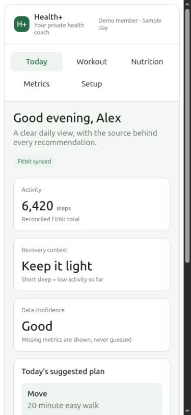
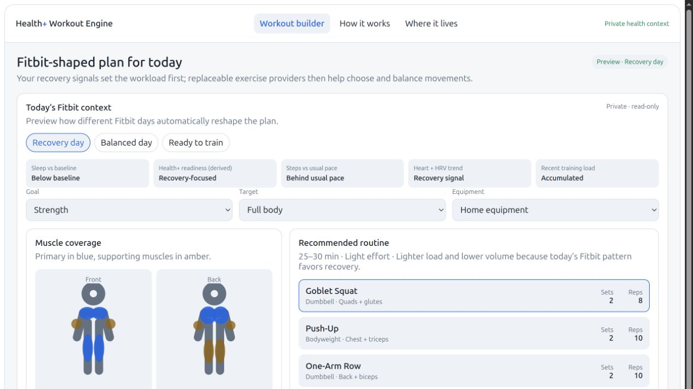
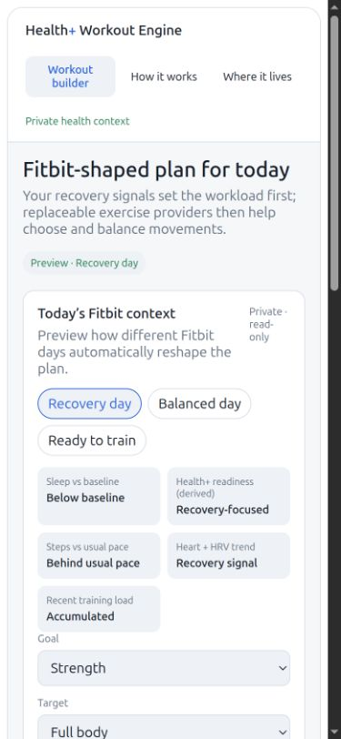
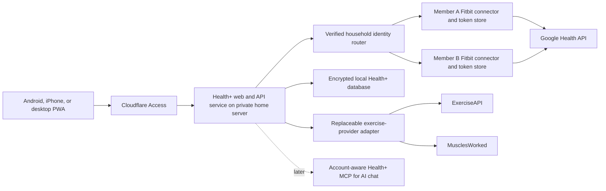

# Health+ product design

Status: approved starting point; implementation has not started.

Health+ is the working name for a private household wellness dashboard that
turns Fitbit trends, a short personal check-in, and reviewed exercise knowledge
into practical, explained workout plans. This document records the intended
experience so the future application can be built without changing the role of
Fitbit MCP.

Health+ is wellness software, not a medical device. It must not diagnose,
treat, or claim to detect illness, injury, overtraining, or metabolic disease.

## Product outcome

The first complete product should let two invited household members:

- privately connect separate Fitbit / Google Health accounts;
- open the same installable web application on Android, iPhone, or desktop;
- understand today's recovery context and the evidence behind it;
- complete a ten-second energy, soreness, pain, time, and location check-in;
- receive and adjust a strength, mobility, or walking/recovery workout;
- use reviewed exercise instructions, alternatives, and muscle coverage;
- log completion, effort, pain flags, and notes, including while offline;
- review useful trends without exposing raw Fitbit payloads or GPS; and
- opt into generic daily reminders without putting health details in a
  notification.

The product is fully designed here but should be delivered in phases. The first
useful implementation milestone is Today + Workout after the account, privacy,
and mobile foundation is proven.

## Experience map

### Today

The landing screen answers three questions in order:

1. What data is available and how current is it?
2. Is today recovery-focused, balanced, or ready to train?
3. What is the smallest useful action to take next?

It shows activity, sleep, resting-heart-rate and HRV trends when available,
recent training load, data confidence, missing signals, and a short plan for
movement, training, and recovery. Every recommendation links back to the signal
or preference that influenced it.

### Workout

The workout builder starts with today's safe workload envelope, then applies
the person's goal, available time, equipment, location, limitations, recent
workout history, and check-in.

The initial training scope is:

- home or gym strength;
- hypertrophy-oriented strength within the same safety envelope;
- full-body, upper-body, or lower-body focus;
- mobility sessions; and
- easy walking or recovery sessions.

Each plan contains duration, intensity, exercises, sets, repetitions or time,
rest, target effort, muscle coverage, alternatives, and a plain-language
rationale. A person can shorten the plan, replace an exercise, or reduce volume.
Health+ must recheck equipment, limitations, and muscle balance after a change.

The initial release logs workouts only inside Health+. Fitbit writeback is a
later, separately approved feature and must require explicit confirmation.

### Trends

Trends compare recent values with the person's own baseline rather than with a
population ranking. The default views are seven and twenty-eight days for:

- sleep duration and efficiency;
- steps and active minutes;
- resting heart rate and HRV availability;
- planned versus completed workouts;
- perceived effort and soreness; and
- data confidence and missing coverage.

The screen must label derived values, partial coverage, and stale data. It must
not fabricate values or present sparse HRV as high-confidence evidence.

### Nutrition

The first Nutrition section is context and habits, not a clinical diet tool. It
may show available Fitbit food/water coverage, saved hydration and protein
goals, dietary preferences or allergies, and gentle observations related to
training and sleep.

Meal planning follows soon after the base experience. Allergies and restrictions
are hard constraints. Calorie or macro targets remain user-supplied or
professionally supplied; Health+ must not prescribe treatment diets.

CGM, laboratory, and medication context are later optional connections with
separate consent, stronger safety review, and clear non-diagnostic boundaries.

### Setup and profile

The owner invites an approved email. Each invited member then:

1. signs in through the private access gate;
2. authorizes their own Fitbit account;
3. chooses goals, timezone, units, equipment, location, and duration;
4. records exercises to avoid, limitations, injuries, or pain;
5. chooses reminder and optional AI preferences; and
6. reviews what is stored, shared, and sent to external providers.

Accounts are private by default. One member cannot view the other's metrics,
profile, history, or recommendations. A future explicit action may share a
workout plan without sharing the signals that created it.

## Visual references

The prototypes are product-design references, not production code. All people,
dates, metrics, and hostnames in them are invented examples.

### Health+ experience

[Open the interactive experience prototype](prototypes/health-plus-experience.html).





### Workout recommendation engine

[Open the interactive workout-engine prototype](prototypes/health-plus-workout-engine.html).





## Architecture

Fitbit MCP stays a focused read-only connector. Health+ becomes a separate
application and, when implementation begins, a separate `health-plus`
repository.



### Hosting and identity

- Run Health+ as a second loopback-only service on the private home server,
  with port `8020` as the proposed default.
- Publish only the protected application route through the existing Cloudflare
  tunnel. The public design uses `health.example.com` as a placeholder.
- Use Cloudflare Access for the approved household emails. The backend must
  validate the Access JWT signature, issuer, audience, expiry, and identity; it
  must not trust an email header by itself.
- Map the verified identity to an internal opaque `user_id` before any profile,
  Fitbit, database, or recommendation operation.
- Keep the existing owner Fitbit MCP portal unchanged. A second person's
  ChatGPT or Claude access is a later account-aware Health+ MCP phase.

### Fitbit account isolation

The current connector uses a configurable token and cache path but represents
one Fitbit account at a time. For the first two-person deployment, use one
isolated connector instance per household member:

- separate service identity or instance configuration;
- separate OAuth state and token file;
- separate cache path and write permissions;
- loopback-only transport; and
- an allowlisted Health+ backend as the only caller.

Health+ owns the multi-user profile and recommendation database. It must never
select a connector from client-supplied paths or ports. The verified `user_id`
selects an allowlisted connector configured by the operator.

### Local data

The first version stores only useful normalized history:

- profile, goals, limitations, and consent settings;
- daily normalized summaries and data-quality markers;
- generated workout plans and their explanations;
- workout completion, actual sets/reps, effort, pain flags, and notes;
- notification preferences and delivery state; and
- generic cached exercise-provider records.

Do not retain raw Fitbit responses, raw model prompts, GPS routes, OAuth tokens,
or third-party API keys in the Health+ database. Token files remain in the
isolated Fitbit connector directories.

Encrypt sensitive Health+ JSON fields with authenticated encryption. Load the
encryption key from a `0600` service secret outside the repository and keep the
recovery copy in the operator's password manager. All database access must be
scoped by verified `user_id`, and account-isolation tests must cover every
read/write endpoint.

A later full local Fitbit archive is opt-in per member and requires a separate
decision record covering encryption, retention, backup, deletion, exports, and
consent before implementation.

### Mobile and offline behavior

Health+ is an installable responsive PWA rather than separate Android and iOS
applications. It should cache only:

- the application shell;
- the current approved workout; and
- unsynchronized workout completion records.

It must not cache historical biometrics for offline browsing. Logout or account
removal clears cached member data. Offline changes use stable client-generated
IDs and synchronize idempotently when connectivity returns. Conflicts preserve
the completed log and ask before replacing a newer server-side edit.

Optional web-push notifications contain generic text only, such as “Your
Health+ check-in is ready.” Each member opts in independently. The design must
explain iPhone home-screen installation and notification requirements.

## Recommendation engine

The engine is hybrid and explained:

1. deterministic safety rules establish the allowed workload;
2. Fitbit and check-in signals choose a readiness category;
3. exercise providers supply generic movement knowledge;
4. optional AI may rank or explain choices inside the allowed envelope; and
5. a deterministic validator accepts, reduces, or rejects the final plan.

### Input priority

Apply inputs in this order:

1. current pain, injury flags, medical constraints, and exercises to avoid;
2. data coverage, freshness, and confidence;
3. the manual energy, soreness, time, and location check-in;
4. sleep, resting-heart-rate, HRV, steps, active minutes, and recent-load trends;
5. goals, equipment, preferred duration, and training schedule; and
6. recent workout completion, effort, and muscle balance.

Safety constraints can only reduce the permitted workload. Missing or stale
data must never be interpreted as a “Ready” signal.

### Readiness categories

- **Recovery-focused:** light walking, mobility, or a substantially reduced
  strength session. Use when recovery context or check-in signals are poor.
- **Balanced:** normal planned volume at controlled effort when signals are
  close to the person's baseline.
- **Ready:** the complete planned session with only a bounded progression when
  recovery, check-in, and recent load all support it.
- **Insufficient data:** use a conservative plan driven by the check-in and
  saved limitations; state what data is missing.

Never show a 0–100 readiness score. Show the category, confidence, reasons,
missing signals, and what changed in the plan.

### Safety stops

- New or concerning pain blocks loaded movements affecting that area and asks
  the member to stop or choose a recovery option.
- Symptoms or medical concerns are directed to qualified clinical care rather
  than optimized by the engine.
- AI cannot increase duration, intensity, volume, or exercise difficulty beyond
  the deterministic envelope.
- An invalid AI response, provider outage, or rate limit falls back to reviewed
  templates or the generic local catalog.
- No recommendation is written to Fitbit or another health system without a
  separate, explicit confirmation flow.

## Exercise-provider boundary

Health+ uses replaceable adapters instead of making either provider a permanent
dependency:

- [ExerciseAPI](https://github.com/westvegh/exerciseapi-mcp-server) is a
  candidate source for exercise records, equipment, difficulty, instructions,
  form guidance, and available media.
- [MusclesWorked](https://musclesworked.com/docs.html) is a candidate source for
  muscle roles, coverage analysis, movement-pattern gaps, and alternatives.

The production dashboard should use provider web APIs from the backend. MCP
remains useful for development and chat workflows. The adapter may send only
generic fields such as exercise ID, muscle, equipment, difficulty, and movement
pattern. It must never send a person's identity, Fitbit signals, readiness
category, injuries, notes, or history.

Before installation, review the provider's repository/package lineage, license,
API terms, pricing, quota, authentication, install scripts, dependency tree,
logging, and failure behavior. Pin any package, keep API keys outside Git, bound
requests and retries, and cache reviewed generic results. Maintain a small
reviewed fallback catalog so a provider outage does not prevent a safe plan.

## Proposed versioned contracts

These are design contracts for the future Health+ repository. They do not add
new Fitbit MCP tools in this documentation phase.

### `WellnessContextV1`

```text
schema_version, generated_at, civil_date, timezone
data_quality: confidence, freshness, missing_signals
signals: sleep_vs_baseline, resting_hr_vs_baseline, hrv_vs_baseline,
         steps_vs_usual_pace, recent_training_load
check_in: energy_1_to_5, soreness_areas, pain_flag, available_minutes, location
profile: goals, equipment, limitations, exercises_to_avoid
recent_workouts: completion, effort, muscle_groups
```

The internal `user_id` is authorization context and is not sent to exercise or
AI providers.

### `WorkoutRecommendationV1`

```text
schema_version, recommendation_id, generated_at, civil_date
readiness: category, confidence, reasons, missing_signals
plan: title, duration_minutes, intensity, target_effort
exercises[]: provider, provider_id, name, equipment, sets, reps_or_time,
             rest_seconds, effort, muscles, alternatives
safety: warnings, blocked_movements, user_confirmation_required
provenance: algorithm_version, provider_versions, optional_ai_used
```

Every optional AI response must validate against this contract and the
deterministic workload envelope before it reaches the member.

### `WorkoutLogV1`

```text
schema_version, workout_log_id, recommendation_id
started_at, completed_at, completion_state
exercise_results[]: exercise_id, completed_sets, actual_reps_or_time
perceived_effort_1_to_10, pain_flag, notes
sync: client_change_id, state, last_attempt_at
```

Pain flags and notes are private member data and must not be sent to exercise
providers.

## Failure behavior

| Condition | Required behavior |
|---|---|
| Fitbit unavailable | Show the last normalized summary as stale and use the manual check-in conservatively. |
| One Fitbit metric fails | Preserve valid metrics, mark partial coverage, and list the failed domain. |
| Exercise provider unavailable | Use cached reviewed records or the local fallback catalog. |
| Optional AI unavailable or invalid | Use the deterministic plan and templated explanation. |
| Offline phone | Open the current plan and queue idempotent completion records. |
| Identity cannot be verified | Deny all account and health access. |
| Account-to-connector mapping missing | Stop and show setup repair; never fall back to another member. |
| Pain or concerning symptoms reported | Suppress inappropriate loaded work and direct the member to a safe stop or qualified care. |

## Delivery phases

### Phase 0 — documentation and operations

- Approve this design, sanitized prototypes, and roadmap.
- Keep Fitbit MCP CI, branch rules, dependency review, and privacy guardrails
  active.
- Add private uptime alerting, release tags, and recovery exercises.
- Track all work publicly only with synthetic examples.

### Phase 1 — Health+ foundation

- Create the separate `health-plus` repository.
- Build the responsive PWA shell and private API service.
- Implement owner invitations, validated identities, account isolation, and
  per-member Fitbit OAuth/connector mapping.
- Add encrypted local storage, consent settings, setup, and privacy controls.

### Phase 2 — Today and Workout

- Implement normalized context, personal baselines, readiness categories, and
  the ten-second check-in.
- Add strength, mobility, and walking/recovery recommendations.
- Add provider adapters, fallback exercises, muscle coverage, substitutions,
  explained changes, and local workout logging.
- Support offline current-plan access and queued completion sync.

### Phase 3 — trends, reminders, and optional AI

- Add seven- and twenty-eight-day trends and data-quality views.
- Add opt-in generic daily and scheduled-workout reminders.
- Add an optional model adapter with per-member consent, minimized context, and
  deterministic output validation.

### Phase 4 — nutrition and meal planning

- Add Fitbit food/water context, hydration/protein targets, and habit views.
- Add allergy-safe, preference-aware, training-aware meal planning.
- Keep clinical nutrition and disease treatment out of scope.

### Phase 5 — broader ecosystem

- Add separately authenticated Health+ MCP access for another household member.
- Evaluate cardio planning and additional exercise sources.
- Evaluate opt-in full local archives, CGM/metabolic sources, laboratory data,
  and controlled exports.
- Evaluate Fitbit writeback only after upstream capability, safety, audit, and
  explicit-confirmation review.

## Acceptance tests for future implementation

The future application is not ready for household use until it proves:

- one authenticated member cannot enumerate, read, infer, or modify another
  member's profile, token state, summary, recommendation, log, or offline data;
- OAuth state cannot be replayed or assigned to the wrong member;
- missing data, poor recovery, pain, provider outages, and AI failures reduce or
  preserve workload rather than increase it;
- exercise swaps respect equipment, limitations, and muscle coverage;
- offline workout logs synchronize exactly once and resolve conflicts safely;
- reminder text contains no health detail;
- Android and iPhone home-screen installations display and log a workout; and
- logs, errors, exports, screenshots, tests, and CI contain only synthetic data.

## Explicitly out of scope now

- application scaffolding or a new repository;
- changes to the running Fitbit MCP service or remote portal;
- a native Android or iPhone application;
- automated diagnosis, treatment, rehabilitation, or clinical nutrition;
- raw Fitbit/GPS archival;
- automatic Fitbit writeback; and
- public signup or users outside the invited household.
